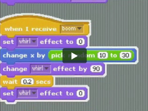

# Leer de basics met Scratch

 Scratch is een drag-'n'-drop programmeertaal waarmee je alle principes van
andere programmeertalen kunt leren. Het is zo opgezet dat je al heel snel games
en animaties kunt maken en langzamerhand uitbreiden en ingewikkelder maken. Op
de website van Scratch is heel veel materiaal te krijgen om verder te leren.

## Let's do it

Start Scratch op de computer:

> **Start &rarr; Run**
> 	\\home\mstegem1\prog\scratch

Download vervolgens de [studiehandleiding](http://www.royalsoced.org.uk/cms/files/education/computing_materials/Starting_from_Scratch_LEARNER.pdf).

Als je Scratch in korte tijd wil uitproberen, begin dan bij hoofdstuk 1:
*Starting from Scratch*. Als je thuis verder gaat, lees dan ook de inleiding om
meer informatie te krijgen over programmeren en computers.

## Maak een Scratch-account

Als je een account maakt op de [website van Scratch](http://scratch.mit.edu/)
dan kun je je programma's uploaden en op een ander moment weer downloaden.
Handig om gedoe met USB-sticks te vermijden.

Doe dat dus eerst even.

## Screencasts

De screencasts die bij de studiehandleiding horen vind je [hier op YouTube](http://www.youtube.com/user/RSEComputing).
